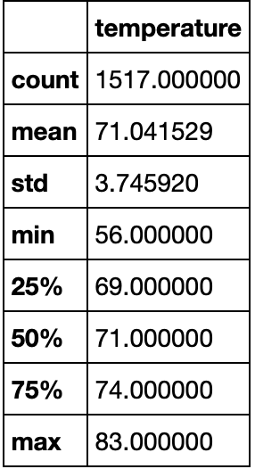

## Surfs_Up Overview
Waves and Ice Cream is looking to open up a shop on the Hawaiian Island of Oahu selling surf boards and refreshments. As they pitch their concept, investors are worried about the weather in determining the role it will play on the shops stability through each season. A analysis of weather data from Oahu, Hawaii will be performed.
## Results

## Summary
=======
Analysis of weather data from June and Decemeber months
* The mean temperature in June is 74.9 degrees versus 71 degress in December
* The max temperature in June is 85 degrees and 83 degrees in Decemeber
* The min temperature in June is 64 degrees versus 56 in December 

##### Resources/ Languages 
* Jupyter Notebook
* VS Code
* SQLite
* SQL Alchemy
* Python (pandas, numpy)
